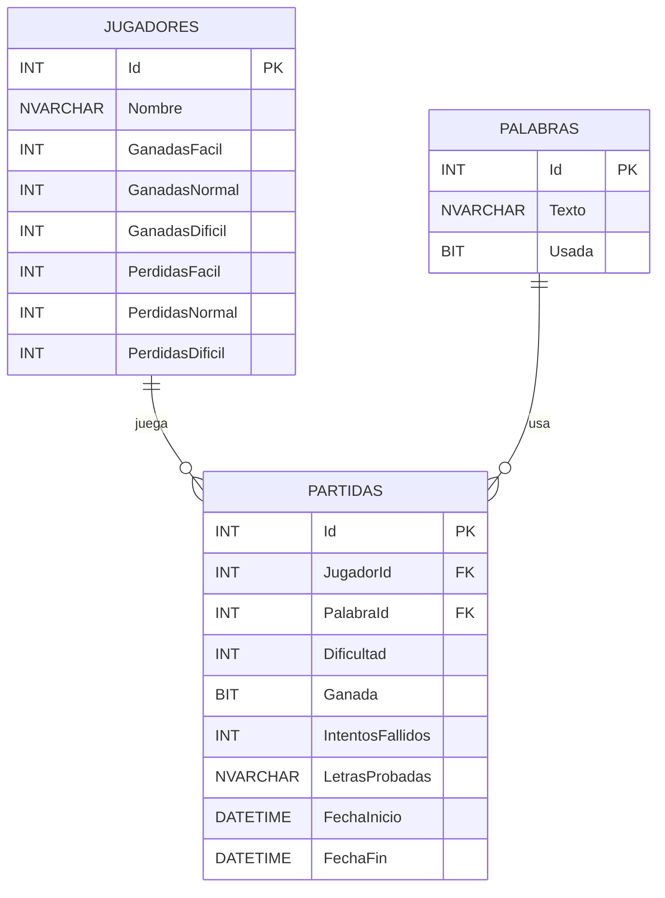
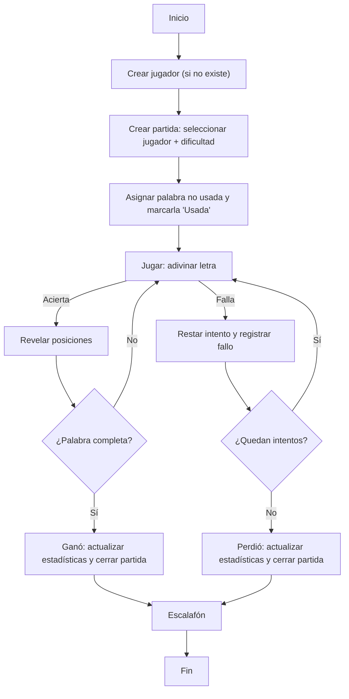

# Ahorcado | Kimberly León

Juego del Ahorcado hecho en **ASP.NET MVC 5** sobre **.NET Framework 4.8.1** con **Entity Framework 6 (Code First)** y **SQL Server LocalDB**.  
Incluye diccionario con **100+ palabras**, gestión de jugadores, partidas por dificultad y escalafón.

---

## 👥 Integrantes (únicos válidos para la nota)

| # | Nombre completo                     | Carné      | Usuario Git  | Correo/Perfil Git |
|---|-------------------------------------|------------|--------------|-------------------|
| 1 | Kimberly Michelle León Ramírez      | FI22026954 | @theleonkim  | https://github.com/theleonkim/Ahorcado_KimberlyLeon |

---

## 🛠️ Stack

- **.NET Framework 4.8.1**
- **ASP.NET MVC 5** (System.Web)
- **Entity Framework 6.5.1** – *Code First + Migrations*
- **SQL Server LocalDB**
- **Bootstrap 3**, **jQuery**, **SweetAlert2** (toasts)

---

---

## 📂 Estructura (resumen)

- `Models/` → `Jugador`, `Palabra`, `Partida`, `Enums.cs`  
- `Data/` → `AhorcadoContext.cs` + `Migrations/`  
- `Controllers/` → `PalabrasController`, `JugadoresController`, `PartidasController`, `HomeController`  
- `Views/` → Razor por controlador + `_Layout`  
- `Content/site.css` → estilos (navbar, nubes, toasts)

---

## 🗃️ Diagrama ER de la base de datos

---

## 🧩 Flujo del juego (alto nivel)

---

## 🔗 Referencias

- ASP.NET MVC 5 – https://learn.microsoft.com/aspnet/mvc/overview/getting-started/introduction/getting-started  
- EF 6 Code First & Migrations – https://learn.microsoft.com/ef/ef6/modeling/code-first/workflows/new-database  
- SQL Server LocalDB – https://learn.microsoft.com/sql/database-engine/configure-windows/sql-server-express-localdb  
- SweetAlert2 – https://sweetalert2.github.io/  
- Mermaid ER/Flow – https://mermaid.js.org/

---

## 📜 Licencia

Uso académico.
