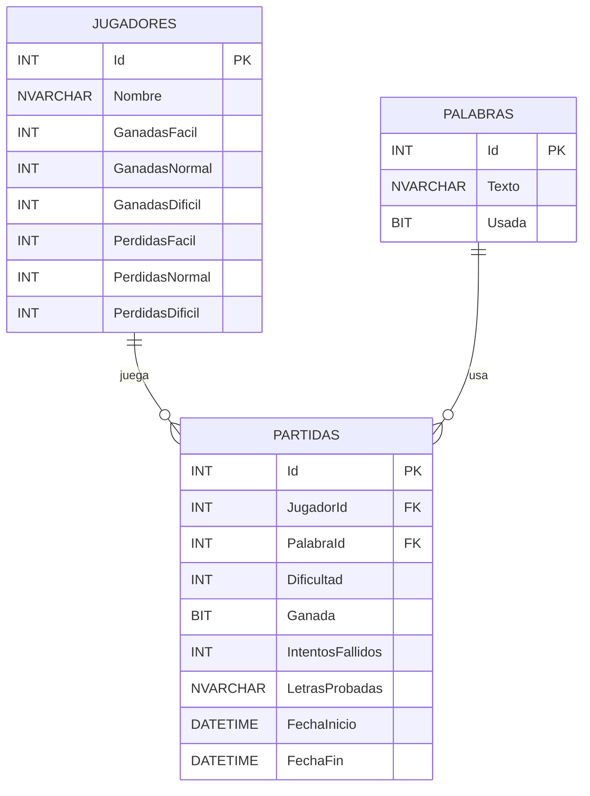
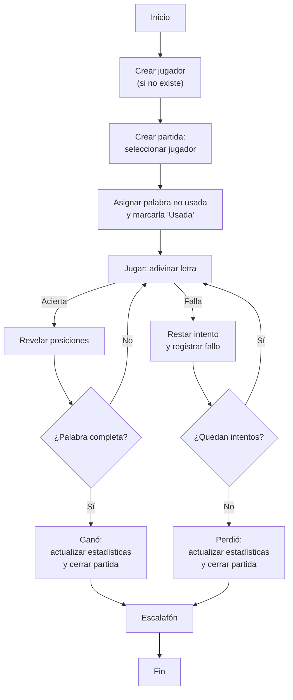

# Ahorcado | Kimberly León

Juego del Ahorcado hecho en **ASP.NET MVC 5** sobre **.NET Framework 4.8.1** con **Entity Framework 6 (Code First)** y **SQL Server LocalDB**.  
Incluye diccionario con **100+ palabras**, gestión de jugadores, partidas por dificultad y escalafón.

---

## 👥 Integrantes (únicos válidos para la nota)

| # | Nombre completo                     | Carné      | Usuario Git  | Correo/Perfil Git |
|---|-------------------------------------|------------|--------------|-------------------|
| 1 | Kimberly Michelle León Ramírez      | FI22026954 | @theleonkim  | https://github.com/theleonkim/Ahorcado_KimberlyLeon |

---

## 🛠️ Stack

- **.NET Framework 4.8.1**
- **ASP.NET MVC 5** (System.Web)
- **Entity Framework 6.5.1** – *Code First + Migrations*
- **SQL Server LocalDB**
- **Bootstrap 3**, **jQuery**, **SweetAlert2** (toasts)

---


---

## 📂 Estructura (resumen)

- `Models/` → `Jugador`, `Palabra`, `Partida`, `Enums.cs`  
- `Data/` → `AhorcadoContext.cs` + `Migrations/`  
- `Controllers/` → `PalabrasController`, `JugadoresController`, `PartidasController`, `HomeController`  
- `Views/` → Razor por controlador + `_Layout`  
- `Content/site.css` → estilos (navbar, nubes, toasts)

---

## 🗃️ Diagrama ER de la base de datos



---

## 🧩 Flujo del juego (alto nivel)



---


📚 Referencias y snippets utilizados

A continuación se listan los sitios consultados, el motivo, el lugar del proyecto donde se aplicó y, cuando aplica, un snippet breve.

Sitio / Recurso	Motivo	Dónde se usa	Snippet / Nota
Microsoft Docs – ASP.NET MVC 5 (Controller, Views, Routing)	Buenas prácticas en controladores, TempData, ViewBag, convenciones de vistas.	Controllers/*, Views/*	https://learn.microsoft.com/aspnet/mvc

Entity Framework 6 Docs (Code First, Migrations)	Crear DbContext, entidades y migraciones con Update-Database.	Data/AhorcadoContext.cs, Migrations/*	https://learn.microsoft.com/ef/ef6/

SQL Server / LocalDB	Cadena de conexión LocalDB para desarrollo.	Web.config → connectionStrings	Data Source=(localdb)\MSSQLLocalDB;Initial Catalog=AhorcadoDb;Integrated Security=True;
Bootstrap 3	Estilos base, grid, botones.	Content/*, Views/Shared/_Layout.cshtml	https://getbootstrap.com/docs/3.4/

jQuery	Enlaces y scripts client-side simples.	Scripts/jquery*.js	https://jquery.com/

SweetAlert2	Toasts para mensajes de éxito al guardar.	Views/Shared/_Layout.cshtml (sección scripts)	https://sweetalert2.github.io/

Mermaid (GitHub Markdown)	Diagrama ER y flujo (Mermaid en README).	README.md	https://mermaid.js.org/
Snippets breves (ejemplos reales usados)

1) Toast de éxito con SweetAlert2 + TempData

@* Views/Shared/_Layout.cshtml *@
@if (TempData["ToastMessage"] != null)
{
    <script>
        Swal.fire({
            toast: true,
            position: 'top-end',
            showConfirmButton: false,
            timer: 2200,
            icon: 'success',
            title: '@TempData["ToastMessage"]'
        });
    </script>
}


2) Acción Create con TempData (PalabrasController)

[HttpPost]
[ValidateAntiForgeryToken]
public async Task<ActionResult> Crear([Bind(Include = "Texto")] Palabra palabra)
{
    if (!ModelState.IsValid) return View(palabra);

    db.Palabras.Add(new Palabra { Texto = palabra.Texto.Trim(), Usada = false });
    await db.SaveChangesAsync();

    TempData["ToastMessage"] = "Palabra guardada con éxito";
    return RedirectToAction("Index");
}


3) EF6 Migrations (verificación de comandos)

Enable-Migrations
Add-Migration InitialCreate
Update-Database


4) Cadena de conexión (LocalDB)

<connectionStrings>
  <add name="AhorcadoContext"
       connectionString="Data Source=(localdb)\MSSQLLocalDB;Initial Catalog=AhorcadoDb;Integrated Security=True;MultipleActiveResultSets=True"
       providerName="System.Data.SqlClient" />
</connectionStrings>

🤖 Prompts de IA utilizados (resumen)

Durante el desarrollo se utilizaron agentes de IA (ChatGPT) para acelerar tareas específicas. A continuación se listan prompts representativos (entrada) y resúmenes de la salida.

1) Controladores CRUD + Toasts

Entrada: “Escríbeme la acción Crear para PalabrasController en ASP.NET MVC 5 con EF6. Al guardar, redirige a Index y usa TempData para un toast SweetAlert2.”

Salida (resumen): Acción HttpPost con ModelState → db.SaveChangesAsync() → TempData["ToastMessage"]="..." → RedirectToAction("Index"). (ver snippet arriba)

2) Navbar y CSS (limpieza y mejoras)

Entrada: “Simplifica el CSS de mi navbar (Bootstrap 3), elimina el efecto ‘burbuja’ raro y deja solo dos opciones: Inicio y Diccionario; quita el hamburguesa en desktop.”

Salida (resumen): Clase .custom-navbar con gradiente; .nav > li > a sin highlight extraño; .navbar-toggle{display:none}; padding-top en body para evitar que tape el contenido.

3) Diagrama Mermaid (ER + Flujo)

Entrada: “Genera un Mermaid erDiagram para Jugadores, Palabras y Partidas; y un flowchart TD con el flujo: crear jugador → crear partida → asignar palabra no usada → jugar (aciertos/fallos) → fin.”

Salida (resumen): Respuestas con bloques ```mermaid corregidos (sin caracteres no admitidos) y ajustados a GitHub Markdown.

4) README (estructura y check de requisitos)

Entrada: “Dame un README en español que incluya: integrantes (tabla), stack, cómo ejecutar (con Update-Database), diagrama Mermaid y referencias a snippets + prompts.”

Salida (resumen): Secciones completas listas para pegar; tablas; enlaces oficiales; instrucciones para corrida limpia.

5) Corrección de errores comunes (vistas/acciones)

Entrada: “Error 404 al navegar a /Partidas/Jugar: revisa rutas/acción/vista.”

Salida (resumen): Sugerencia de renombrar vista a Jugar.cshtml o ajustar RedirectToAction("Juego")/return View("Jugar"); validar nombres de archivos Razor y ActionLink.

Agente usado: ChatGPT (OpenAI).
Uso: soporte puntual para scaffolding de controladores, toasts, CSS del navbar, Mermaid y redacción del README.
Criterios de validación: todo código generado se revisó, adaptó y probó antes de integrarse.

---

## 📜 Licencia

Uso académico.
