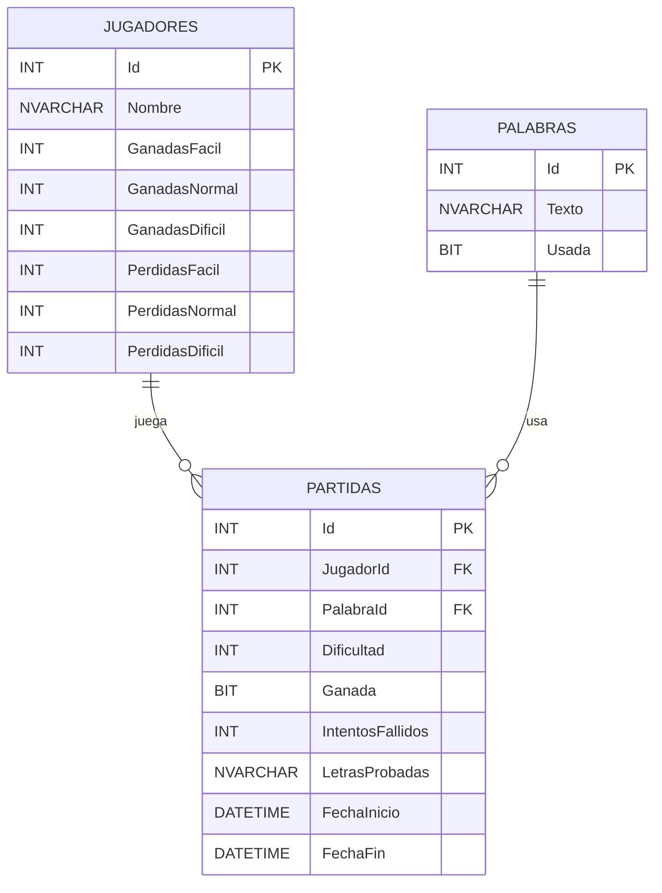
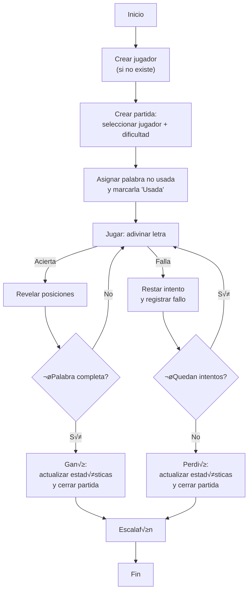

# Ahorcado | Kimberly León

Juego del Ahorcado hecho en **ASP.NET MVC 5** sobre **.NET Framework 4.8.1** con **Entity Framework 6 (Code First)** y **SQL Server LocalDB**.  
Incluye diccionario con **100+ palabras**, gestión de jugadores, partidas por dificultad y escalafón.

---

## üë• Integrantes (√∫nicos v√°lidos para la nota)

| # | Nombre completo                     | Carné      | Usuario Git  | Correo/Perfil Git |
|---|-------------------------------------|------------|--------------|-------------------|
| 1 | Kimberly Michelle León Ramírez      | FI22026954 | @theleonkim  | https://github.com/theleonkim/Ahorcado_KimberlyLeon |

---

## 🛠️ Stack

- **.NET Framework 4.8.1**
- **ASP.NET MVC 5** (System.Web)
- **Entity Framework 6.5.1** – *Code First + Migrations*
- **SQL Server LocalDB**
- **Bootstrap 3**, **jQuery**, **SweetAlert2** (toasts)

---

---

## 📂 Estructura (resumen)

- `Models/` ‚Üí `Jugador`, `Palabra`, `Partida`, `Enums.cs`  
- `Data/` ‚Üí `AhorcadoContext.cs` + `Migrations/`  
- `Controllers/` ‚Üí `PalabrasController`, `JugadoresController`, `PartidasController`, `HomeController`  
- `Views/` ‚Üí Razor por controlador + `_Layout`  
- `Content/site.css` ‚Üí estilos (navbar, nubes, toasts)

---

## 🗃️ Diagrama ER de la base de datos

```mermaid
erDiagram
    JUGADORES ||--o{ PARTIDAS : juega
    PALABRAS  ||--o{ PARTIDAS : usa

    JUGADORES {
      INT Id PK
      NVARCHAR Nombre
      INT GanadasFacil
      INT GanadasNormal
      INT GanadasDificil
      INT PerdidasFacil
      INT PerdidasNormal
      INT PerdidasDificil
    }

    PALABRAS {
      INT Id PK
      NVARCHAR Texto
      BIT Usada
    }

    PARTIDAS {
      INT Id PK
      INT JugadorId FK
      INT PalabraId FK
      INT Dificultad
      BIT Ganada
      INT IntentosFallidos
      NVARCHAR LetrasProbadas
      DATETIME FechaInicio
      DATETIME FechaFin
    }
```

---

## üß© Flujo del juego (alto nivel)

```mermaid
flowchart TD
    A["Inicio"]
    B["Crear jugador<br/>(si no existe)"]
    C["Crear partida:<br/>seleccionar jugador + dificultad"]
    D["Asignar palabra no usada<br/>y marcarla 'Usada'"]
    E["Jugar: adivinar letra"]
    F["Revelar posiciones"]
    G["Restar intento<br/>y registrar fallo"]
    H{"¬øPalabra completa?"}
    I{"¬øQuedan intentos?"}
    J["Ganó:<br/>actualizar estadísticas<br/>y cerrar partida"]
    K["Perdió:<br/>actualizar estadísticas<br/>y cerrar partida"]
    L["Escalafón"]
    M["Fin"]

    A --> B --> C --> D --> E
    E -- Acierta --> F
    E -- Falla --> G
    F --> H
    G --> I
    H -- Sí --> J
    H -- No --> E
    I -- Sí --> E
    I -- No --> K
    J --> L
    K --> L
    L --> M

   
```

---

## üîó Referencias

- ASP.NET MVC 5 – https://learn.microsoft.com/aspnet/mvc/overview/getting-started/introduction/getting-started  
- EF 6 Code First & Migrations – https://learn.microsoft.com/ef/ef6/modeling/code-first/workflows/new-database  
- SQL Server LocalDB – https://learn.microsoft.com/sql/database-engine/configure-windows/sql-server-express-localdb  
- SweetAlert2 – https://sweetalert2.github.io/  
- Mermaid ER/Flow – https://mermaid.js.org/

---

## üìú Licencia

Uso académico.
